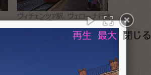

## jQuery lightbox "FancyBox"にカスタムボタン追加<br />Add custom button for jQuery lightbox "FancyBox"<!-- omit in toc -->

[Home](https://oasis3855.github.io/webpage/) > [Software](https://oasis3855.github.io/webpage/software/index.html) > [Software Download](https://oasis3855.github.io/webpage/software/software-download.html) > [webservice-scripts](../README.md) > ***fancybox_custombutton*** (this page)

<br />
<br />

Last Updated : Feb. 2016

- [ソフトウエアのダウンロード](#ソフトウエアのダウンロード)
- [概要](#概要)
- [サンプルWebサイト](#サンプルwebサイト)
- [ソースコード改変 主要部分の抜粋](#ソースコード改変-主要部分の抜粋)
- [バージョンアップ履歴](#バージョンアップ履歴)
- [ライセンス](#ライセンス)
  - [オリジナル版のライセンス](#オリジナル版のライセンス)
  - [私が改変した部分のライセンス](#私が改変した部分のライセンス)


<br />
<br />

## ソフトウエアのダウンロード

-    [このGitHubリポジトリを参照する（ソースコード）](../fancybox_custombutton/src/) 
-    [このGitHubリポジトリを参照する（オリジナル版および改変版の圧縮ファイル）](../fancybox_custombutton/download/) 

<br />
<br />

## 概要

画像表示のjQueryライブラリ[FancyBox](https://fancyapps.com/fancybox/)に、フルスクリーン表示ボタン、スライドショー開始・終了のカスタムボタンを追加する機能拡張を行った。 

<br />


<br />画面右上の「閉じる」ボタンの隣に、**「スライドショー再生」「最大」のボタンを追加**した状況

<br />
<br />

## サンプルWebサイト

拙作 [イタリア ヴィチェンツァ 旅行写真集](https://oasis.halfmoon.jp/extphoto/italy-18.html)

<br />
<br />

## ソースコード改変 主要部分の抜粋

jquery.fancybox.js の処理主要部抜粋


80行目付近
``` javascript
  $.extend(F, {
    // The current version of fancyBox
    version: '2.1.5',
 
    defaults: {
      padding : 15,
      margin  : 20,
      // 〜 中略 〜 
      topRatio    : 0.5,
      leftRatio   : 0.5,

      /******
       * Full Screen flag (**Add by H.INOUE 2016.FEB.13)
       ******/
      modeFullScreen : false,    // フルスクリーン状態を保存するフラグ変数を追加した
 
      scrolling : 'auto', // 'auto', 'yes' or 'no'
      wrapCSS   : '',
```

1310行目付近
``` javascript
    _setDimension: function () {
      var viewport   = F.getViewport(),
      // 〜 中略 〜 
      if (current.aspectRatio) {
        if (width > maxWidth) {
          width  = maxWidth;
          height = getScalar(width / ratio);
        }
 
        if (height > maxHeight) {
          height = maxHeight;
          width  = getScalar(height * ratio);
        }
 
        if (width < minWidth) {
          width  = minWidth;
          height = getScalar(width / ratio);
        }
 
        if (height < minHeight) {
          height = minHeight;
          width  = getScalar(height * ratio);
        }
 
        /*****
         * Full Screen mode, added by H.INOUE 2016.FEB.13
         *****/
        if(F.opts.modeFullScreen == true){
          width  = maxWidth;
          height = getScalar(width / ratio);
          if (height > maxHeight) {
            height = maxHeight;
            width  = getScalar(height * ratio);
          }
        }
```

1470行目付近
``` javascript
    _afterZoomIn: function () {
      // 〜 中略 〜 
      // Create a close button
      if (current.closeBtn) {
        $(current.tpl.closeBtn).appendTo(F.skin).bind('click.fb', function(e) {
          e.preventDefault();
 
          F.close();
        });
 
        /*****
         * Full Screen (toggle) button, added by H.INOUE 2016.FEB.13
         *****/
        $(current.tpl.fullscreenBtn).appendTo(F.skin).bind('click.fb', function(e) {
          e.preventDefault();
          if(F.opts.modeFullScreen == true) {
            F.opts.modeFullScreen = false;
            F.opts.margin = 20;
            F.opts.helpers.title.type = 'outside';
          }
          else {
            F.opts.modeFullScreen = true;
            F.opts.margin = 1;
            F.opts.helpers.title.type = 'over';
          }
          F.update();
        });
 
        /*****
         * Slideshow Play (toggle) button, added by H.INOUE 2016.FEB.13
         *****/
        $(current.tpl.playBtn).appendTo(F.skin).bind('click.fb', function(e) {
          e.preventDefault();
          // toggle Slideshow
          F.play();
        });
```

<br />
<br />

## バージョンアップ履歴

- Original Version 2.1.5 (2013/06/14)
- 改変 Version 2.1.5-01 (2016/02/13)

<br />
<br />

## ライセンス

### オリジナル版のライセンス

改変のベースとなったオリジナル版 fancyBox version 2.1.5 の使用許諾条件は [Creative Commons ライセンスAttribution-NonCommercial 3.0 Unported（表示 – 非営利 3.0 非移植 ）](https://creativecommons.org/licenses/by-nc/3.0/deed.ja) だそうです。

> FancyBox licensed under Creative Commons Attribution-NonCommercial 3.0 license. Free non-profit websites. For commercial use see http://sites.fastspring.com/fancyapps/product/store. 

最新版は有償なので、過去バージョンで問題ないならそのまま使い続けるのがが良いと思われます。

### 私が改変した部分のライセンス

私が改変した部分の著作権は放棄します。


