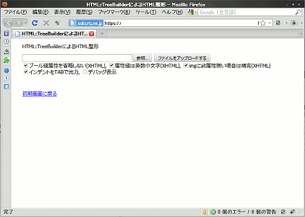
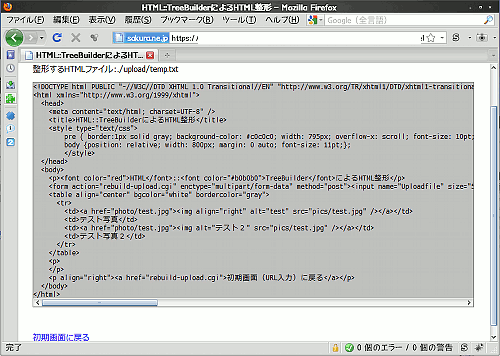

## HTML::TreeBuilderによるHTML整形Perlスクリプト （XHTML対応）<!-- omit in toc -->

[Home](https://oasis3855.github.io/webpage/) > [Software](https://oasis3855.github.io/webpage/software/index.html) > [Software Download](https://oasis3855.github.io/webpage/software/software-download.html) > [webservice-scripts](../README.md) > ***html-treebuilder*** (this page)

 
 

Last Updated : Mar. 2022

- [ソフトウエアのダウンロード](#ソフトウエアのダウンロード)
- [概要](#概要)
- [動作確認済み](#動作確認済み)
- [インストール方法](#インストール方法)
- [バージョン情報](#バージョン情報)
- [ライセンス](#ライセンス)

 
 

## ソフトウエアのダウンロード

-    [このGitHubリポジトリを参照する（ソースコード）](../html-treebuilder/) 

## 概要

HTMLファイルのソースコードのインデントを整え、HTML/XHTML規格に準拠していない属性値を修正して画面表示します。ユーザは任意のローカルファイルをアップロードして整形対象にすることが出来ます。 

対象ファイルアップロード画面 (html-rebuild-upload.cgi)

 

HTML/XHTML整形結果の表示画面 

 

## 動作確認済み

- FreeBSD 11.2 , Perl 5.26  (さくらインターネット 共用サーバ)

## インストール方法

設置するサーバのルールに従って、スクリプトの属性を設定してください。

このスクリプトは、設定ファイルや動作に伴うファイル出力などは行いません。

## バージョン情報

- Version 1.0 (2010/03/13)
  - html-rebuild-simple.cgi , html-rebuild-upload.cgi 新規
- Version 1.1 (2010/03/19)
  - html-rebuild-upload.cgi
- Version 1.2 (2022/03/24)
  - html-rebuild-upload.cgi UIページのUTF-8対応HTMLコード修正

## ライセンス

このスクリプトは [GNU General Public License v3ライセンスで公開する](https://www.gnu.org/licenses/gpl-3.0.html) フリーソフトウエア
