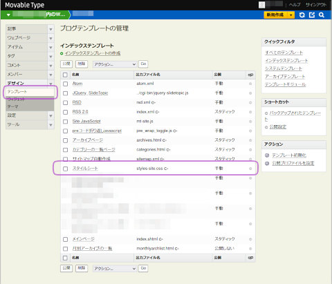
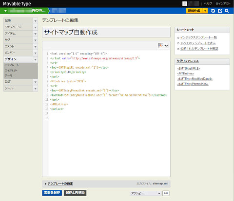
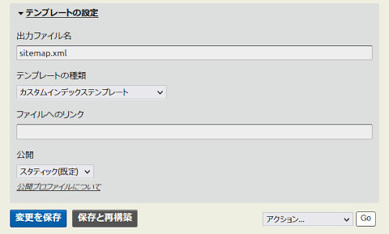

## MovableTypeでのXML形式サイトマップファイル自動生成スクリプト<br />sitemap build script on MovableType<!-- omit in toc -->

[Home](https://oasis3855.github.io/webpage/) > [Software](https://oasis3855.github.io/webpage/software/index.html) > [Software Download](https://oasis3855.github.io/webpage/software/software-download.html) > [webservice-scripts](../README.md) > ***sitemap-movabletype*** (this page)

<br />
<br />

Last Updated : Apr. 2010

- [ソフトウエアのダウンロード](#ソフトウエアのダウンロード)
- [概要](#概要)
- [インストール方法](#インストール方法)
- [動作確認済み環境](#動作確認済み環境)
- [robots.txt を作成する](#robotstxt-を作成する)
- [参考資料](#参考資料)
- [バージョンアップ履歴](#バージョンアップ履歴)
- [ライセンス](#ライセンス)


<br />
<br />

## ソフトウエアのダウンロード

-    [このGitHubリポジトリを参照する（ソースコード）](../sitemap-movabletype/) 

<br />
<br />

## 概要

Movable Typeで記事追加時に、自動的にサイトマップファイルを作成させるためのインデックス・テンプレート。

Niall Kennedy - Google Sitemaps using Movable Type (June 3, 2005) [https://www.niallkennedy.com/blog/2005/06/google-sitemaps.html](https://www.niallkennedy.com/blog/2005/06/google-sitemaps.html) よりソースコードをまるごとコピーした。

※ ファイルシステム上にすでに存在する html ファイルの一覧をXML形式サイトマップにするには、拙作 [静的サイトのXML形式サイトマップファイル自動生成スクリプト（Linux, BSD）](../sitemap-txt2xml/README.md) を参照。

<br />
<br />

## インストール方法

Movable Typeの画面左のメニューより「デザイン」> 「テンプレート」画面を開く



<br />

インデックステンプレートの作成をクリックして、「テンプレートの編集」画面を開き、



[このテンプレート スクリプト](./template-sitemap.txt) を貼り付ける。

<br />

「テンプレートの編集」画面の一番下にある「テンプレートの設定」を開いて、次のように設定し、記事更新時にサイトマップを自動更新されるようにする。



- 出力ファイル名 : sitemap.xml
- テンプレートの種類 : カスタム インデックス テンプレート
- ファイルの種類 : (この入力欄は空欄のままとする)
- 公開 : スタティック(規定)

<br />
<br />

## 動作確認済み環境

- Movable Type 3.33
- Movable Type 6.7.5

<br />
<br />

## robots.txt を作成する

サイトのルートディレクトリに置いたrobots.txtに、そのサイト内の全てのサイトマップファイルを指定する。 

```
User-Agent: *
Disallow: /cgi-bin/
Allow: /
Sitemap: http://example.com/sitemap-1.xml
Sitemap: http://example.com/sitemap-2.xml
```

<br />
<br />

## 参考資料

sitemap XML ファイルの書式は、sitemaps.org の 「[サイトマップの XML 形式](https://sitemaps.org/ja/protocol.html)」に詳しく説明されている

Google検索セントラルには、「[サイトマップの作成と送信](https://developers.google.com/search/docs/crawling-indexing/sitemaps/build-sitemap?hl=ja)」という解説記事も公開されている

<br />
<br />

## バージョンアップ履歴

- 転載 (2010/04/07)

<br />
<br />

## ライセンス

このスクリプトの著作権はNiall Kennedyの判断に属する。詳細はNiall Kennedy氏のWebページを参照してください。

Niall Kennedy - Google Sitemaps using Movable Type (June 3, 2005) [https://www.niallkennedy.com/blog/2005/06/google-sitemaps.html](https://www.niallkennedy.com/blog/2005/06/google-sitemaps.html) 

