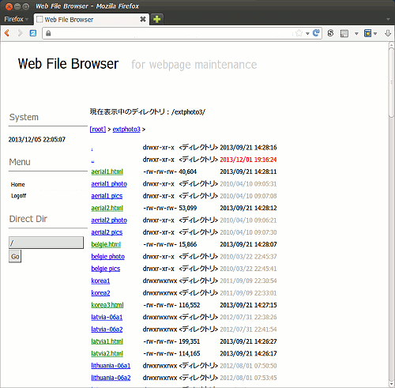
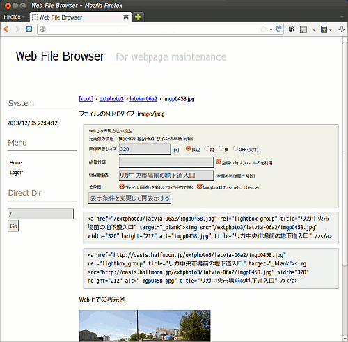

## Webファイルブラウザ（Linux, BSD Web Service）<br />Web file browser script<!-- omit in toc -->

[Home](https://oasis3855.github.io/webpage/) > [Software](https://oasis3855.github.io/webpage/software/index.html) > [Software Download](https://oasis3855.github.io/webpage/software/software-download.html) > [webservice-scripts](../README.md) > ***web-file-browser*** (this page)

<br />
<br />

Last Updated : Dec. 2013

- [ソフトウエアのダウンロード](#ソフトウエアのダウンロード)
- [概要](#概要)
- [動作確認済み](#動作確認済み)
- [インストール方法](#インストール方法)
- [このスクリプトは個人利用想定のセキュリティ確保しかしていません](#このスクリプトは個人利用想定のセキュリティ確保しかしていません)
- [バージョン情報](#バージョン情報)
- [ライセンス](#ライセンス)

<br />
<br />

## ソフトウエアのダウンロード

-    [このGitHubリポジトリを参照する（ソースコード）](../web-file-browser/) 

## 概要

Webサーバ内のディレクトリやファイルの一覧を表示したり、HTMLファイル記述時用に画像やデータファイルなどへのリンク（HTMLソースコード）を自動作成することができます。



ディレクトリ、ファイル一覧画面



ファイルへのリンク（HTMLソースコード）の表示画面

## 動作確認済み

- FreeBSD 11.2 , PHP 5.2  (さくらインターネット 共用サーバ)

## インストール方法

設置するサーバのルールに従って、スクリプトと設定ファイルの属性を設定してください。ソースコード中で、次の箇所はユーザ環境にしたがって書き換えてください。

```PHP
$strBaseDir = "/home/ユーザ名/www";
$strAbsolutePath = 'http://www.example.com';
```

他者がこのスクリプトを使えないように、認証などを行うことをお勧めします。 

## このスクリプトは個人利用想定のセキュリティ確保しかしていません

ここで配布するスクリプトは、個人用として使うことを想定し、不特定多数に公開するレベルのセキュリティ基準を満たしていません。必ず、.htaccess によるディレクトリ自体のアクセス認証を掛けて、本人以外のアクセスが行えないよう設定して下さい。

## バージョン情報

- Version 1.0 (2010/02/21)
- Version 1.1 (2010/02/23)
- Version 1.11 (2013/03/11)
- Version 1.2 (2013/12/05)
  - 画面構成変更
  - ディレクトリ階層認識
  - fancyboxタグ対応


## ライセンス

このスクリプトは [GNU General Public License v3ライセンスで公開する](https://gpl.mhatta.org/gpl.ja.html) フリーソフトウエア
