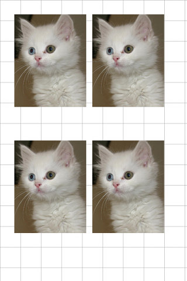
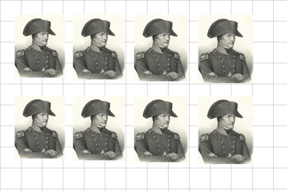

##  証明写真作成PHPスクリプト id passport photo creation php script for Linux and BSD<!-- omit in toc -->

[Home](https://oasis3855.github.io/webpage/) > [Software](https://oasis3855.github.io/webpage/software/index.html) > [Software Download](https://oasis3855.github.io/webpage/software/software-download.html) > [webservice-scripts](../README.md) > ***web-idpassport-photo*** (this page)

 
 

Last Updated : Mar. 2022

- [ソフトウエアのダウンロード](#ソフトウエアのダウンロード)
- [概要](#概要)
  - [作成される画像ファイルの例](#作成される画像ファイルの例)
- [動作確認済み](#動作確認済み)
- [インストール方法](#インストール方法)
- [バージョン情報](#バージョン情報)
- [ライセンス](#ライセンス)

 
 

## ソフトウエアのダウンロード

-    [このGitHubリポジトリを参照する（ソースコード）](../web-idpassport-photo/) 

## 概要

コンビニ・家電量販店・スーパー等に設置されている「写真プリント機」や「マルチコピー機」で、運転免許やパスポートなどに使う証明写真を出力させるための画像ファイルを作成するためのスクリプトです。

「証明写真機」を使うと500円以上掛かるものが、このスクリプトで作成した画像ファイルを「写真プリント機」で出力すると、50円程度で出来てしまう。

自身のWebサーバに設置して使う、サーバサイドのスクリプトです。

### 作成される画像ファイルの例

***L版に対応した600万画素相当（3072 x 2048 ピクセル）の画像ファイル***を作成できます。ここに示す例は、画像を縮小しています。 

パスポート用写真サイズ（45mmx35mm）

 

写真のサイズを少しずつ変化させて、要求されるサイズにぴったり合わせることも出来ます。 

運転免許書用写真サイズ（30mmx24mm）

 

サンプル画像では、Wikimedia Commonsの[ナポレオン・ボナパルト](https://commons.wikimedia.org/wiki/File:Bonabarte_Premier_consul.jpg)と[ヴァン猫](https://commons.wikimedia.org/wiki/File:Turkish_Van_Cat.jpg)の写真を利用しています。 

## 動作確認済み

- FreeBSD 11.2 , PHP 5.2  (さくらインターネット 共用サーバ)

## インストール方法

Webサーバ上に適当なフォルダを作成して、スクリプトファイルを置いて下さい。また、設置するサーバのルールに従って、スクリプトの属性を設定してください。

[画像処理 (GD)](https://www.php.net/manual/ja/book.image.php) ライブラリが必要です

このスクリプトと同じフォルダに、ユーザからアップロードされる画像ファイルが一時的に保存されます。また、ログファイルもこのフォルダ上に保存されます。

## バージョン情報

- Version 1.0 (2010/08/04)
- Version 1.1 (2022/03/31)
  - アップロードする最大ファイルサイズ制限を0.5MBytesから1.0MBytesに変更

## ライセンス

このスクリプトは [GNU General Public License v3ライセンスで公開する](https://www.gnu.org/licenses/gpl-3.0.html) フリーソフトウエア
