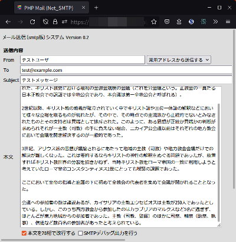

## シンプルなメール送受信PHPスクリプト（Linux, BSD Web Service）<br />Simple mail send/receive PHP script<!-- omit in toc -->

[Home](https://oasis3855.github.io/webpage/) > [Software](https://oasis3855.github.io/webpage/software/index.html) > [Software Download](https://oasis3855.github.io/webpage/software/software-download.html) > [webservice-scripts](../README.md) > ***web-mail-sendview*** (this page)

<br />
<br />

Last Updated : Feb. 2021

- [ソフトウエアのダウンロード](#ソフトウエアのダウンロード)
- [概要](#概要)
  - [newssend, newsread について](#newssend-newsread-について)
- [動作確認済み](#動作確認済み)
- [インストール方法](#インストール方法)
- [このスクリプトは個人利用想定のセキュリティ確保しかしていません](#このスクリプトは個人利用想定のセキュリティ確保しかしていません)
- [バージョン情報](#バージョン情報)
- [ライセンス](#ライセンス)

<br />
<br />

## ソフトウエアのダウンロード

-    [このGitHubリポジトリを参照する（ソースコード）](../web-mail-sendview/) 

## 概要

PHPスクリプトでメールを送受信するサンプルWebサービス。imapまたはsmtpでのメール送信、imapまたはpop3でのメール受信が組み込まれている。


imap接続でメール一覧を取得し画面表示

それぞれのメールはリンク形式となっており、クリックするとメール本文を表示する


imap接続でメール本文を画面表示



smtpでメール送信する画面


imap接続でエラーメッセージを表示するうデバッグ画面

GMailなど、初回接続時にデバッグメッセージ中に「Web認証用URL」が含まれている場合には、この機能を使ってURLを取得する

### newssend, newsread について

Webニュースの記事をスクラップするために、送信・受信メールサーバやメールタイトルなどを固定した簡易版。

たとえば、mailviewsendのview-imapmail.phpではメールサーバを選択できるが、newsreadのview-imapmail.phpはメールサーバが次のように固定されている。

```PHP
// メールアカウントの指定
$account_no = 1;
```

## 動作確認済み

- FreeBSD 11.2 , PHP 5.2  (さくらインターネット 共用サーバ)

- FreeBSD 11.2 , PHP 7.2  (さくらインターネット 共用サーバ)

## インストール方法

authディレクトリ内のファイルには、メールサーバのユーザ名やパスワードが格納されるため、webからはアクセスできないディレクトリ内に設置すること。

動作確認した さくらインターネット共用サーバ では、web公開ディレクトリ ``` ~/www/dir/ ``` ではなく、``` ~/www ``` 以外のディレクトリ内に設置した。

```PHP
// メールアカウント管理コンポーネントを用いる
require_once($info['dir'].'/auth/script/mail_account.php');
```

## このスクリプトは個人利用想定のセキュリティ確保しかしていません

ここで配布するスクリプトは、個人用として使うことを想定し、不特定多数に公開するレベルのセキュリティ基準を満たしていません。必ず、.htaccess によるディレクトリ自体のアクセス認証を掛けて、本人以外のアクセスが行えないよう設定して下さい。

## バージョン情報

- Version 0.1 (2009/04/29)
- Version 0.2 (2012/03/05)
- Version 0.3 (2013/08/07)
  - newssendのみ修正
- Version 0.3.1 (2021/02/27)
  - view-imapmail-debug.php : imapデバッグメッセージ表示

## ライセンス

このスクリプトは [GNU General Public License v3ライセンスで公開する](https://gpl.mhatta.org/gpl.ja.html) フリーソフトウエア
