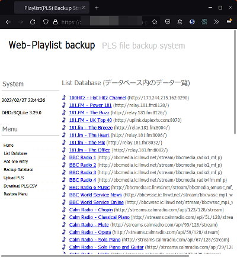
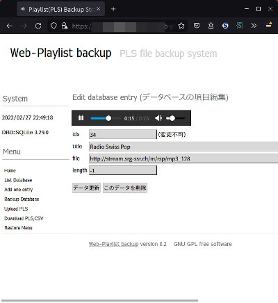

## mp3ストリーミングのプレイリスト(PLS)管理Perlスクリプト（Linux, BSD Web Service） mp3 streaming station playlist (pls) backup web service<!-- omit in toc -->

[Home](https://oasis3855.github.io/webpage/) > [Software](https://oasis3855.github.io/webpage/software/index.html) > [Software Download](https://oasis3855.github.io/webpage/software/software-download.html) > [webservice-scripts](../README.md) > ***web-playlist-backup*** (this page)

 
 

Last Updated : Jan. 2016

- [ソフトウエアのダウンロード](#ソフトウエアのダウンロード)
- [概要](#概要)
- [動作確認済み](#動作確認済み)
- [バージョン情報](#バージョン情報)
- [ライセンス](#ライセンス)

 
 

## ソフトウエアのダウンロード

-    [このGitHubリポジトリを参照する（ソースコード）](../web-playlist-backup/) 

## 概要

ストリーミング ミュージック再生アプリからバックアップ取得したプレイリスト（PLS）ファイルを、web上で管理するためのスクリプト。web上でストリーミングサイトを新規追加・編集・再生することも出来る。

ストリーミングサイト一覧表示

ストリーミングサイトの編集・再生画面

## 動作確認済み

- FreeBSD 11.2 , Perl 5.26  (さくらインターネット 共用サーバ)

## バージョン情報

- Version 0.1 (2011/04/06)
- Version 0.1 (2016/01/03)
  - HTML5 audio再生対応

## ライセンス

このスクリプトは [GNU General Public License v3ライセンスで公開する](https://gpl.mhatta.org/gpl.ja.html) フリーソフトウエア
