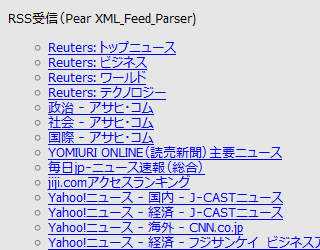
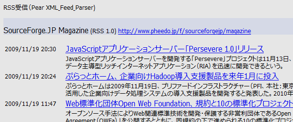

## RSS巡回表示（Linux, BSD Web Service）<br />RSS reader<!-- omit in toc -->

[Home](https://oasis3855.github.io/webpage/) > [Software](https://oasis3855.github.io/webpage/software/index.html) > [Software Download](https://oasis3855.github.io/webpage/software/software-download.html) > [webservice-scripts](../) > ***web-rss-receive*** (this page)

<br />
<br />

Last Updated : Sep. 2014

- [ソフトウエアのダウンロード](#ソフトウエアのダウンロード)
- [概要](#概要)
- [動作確認済み](#動作確認済み)
- [インストール方法](#インストール方法)
- [このスクリプトは個人利用想定のセキュリティ確保しかしていません](#このスクリプトは個人利用想定のセキュリティ確保しかしていません)
- [バージョン情報](#バージョン情報)
- [ライセンス](#ライセンス)

<br />
<br />

## ソフトウエアのダウンロード

-    [このGitHubリポジトリを参照する（ソースコード）](../web-rss-receive/) 

## 概要

シンプルなRSSブラウザ。表示するRSSサイトはWeb上で編集可能。



RSSサイト一覧表示



RSSの記事を詳細表示

Web画面より編集可能な、RSSサイト設定ファイル (rss_receive.ini)

```
days=3,desc=1,count=30
https://news.yahoo.co.jp/rss/media/sasahi/all.xml,AERA dot. - Yahoo!ニュース
https://news.yahoo.co.jp/rss/media/binsider/all.xml,BUSINESS INSIDER JAPAN - Yahoo!ニュース
https://news.yahoo.co.jp/rss/media/newsweek/all.xml,ニューズウィーク日本版 - Yahoo!ニュース
https://news.yahoo.co.jp/rss/media/impress/all.xml,Impress Watch - Yahoo!ニュース
https://news.yahoo.co.jp/rss/media/zdn_m/all.xml,ITmedia Mobile - Yahoo!ニュース
```

## 動作確認済み

- FreeBSD 11.2 , PHP 5.2   (さくらインターネッ 共用サーバ)

## インストール方法

設置するサーバのルールに従って、スクリプトと設定ファイルの属性を設定してください。PHPはPEARが使えることとし、XML/Feed/Parser.phpコンポーネントがインストールされている状態でなければいけません。

設定ファイル(rss_receive.ini)の1行目はスクリプトの動作を規定するもので、次のような内容です。

```
days=2,desc=1,count=10
```

- days : 過去何日分のデータを表示するか 
- desc : 本文を表示するか 
- count : 最大何個のトピックを表示するか 

## このスクリプトは個人利用想定のセキュリティ確保しかしていません

ここで配布するスクリプトは、個人用として使うことを想定し、不特定多数に公開するレベルのセキュリティ基準を満たしていません。必ず、.htaccess によるディレクトリ自体のアクセス認証を掛けて、本人以外のアクセスが行えないよう設定して下さい。

## バージョン情報

- Version 1.01 (2009/11/29)
- Version 1.1 (2014/09/16)

## ライセンス

このスクリプトは [GNU General Public License v3ライセンスで公開する](https://gpl.mhatta.org/gpl.ja.html) フリーソフトウエア

