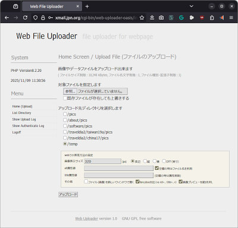
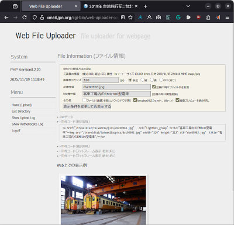

## Webファイルアップローダー（PHP script for Linux, BSD Web Service）<br />Web file uploader (PHP script)<!-- omit in toc -->

[Home](https://oasis3855.github.io/webpage/) > [Software](https://oasis3855.github.io/webpage/software/index.html) > [Software Download](https://oasis3855.github.io/webpage/software/software-download.html) > [webservice-scripts](../README.md) > ***web-uploader-php*** (this page)

<br />
<br />

Last Updated : Sep. 2025

- [ソフトウエアのダウンロード](#ソフトウエアのダウンロード)
- [概要](#概要)
- [動作確認済み](#動作確認済み)
- [インストール方法](#インストール方法)
- [このスクリプトは個人利用想定のセキュリティ確保しかしていません](#このスクリプトは個人利用想定のセキュリティ確保しかしていません)
- [バージョン情報](#バージョン情報)
- [ライセンス](#ライセンス)

<br />
<br />

## ソフトウエアのダウンロード

-    [このGitHubリポジトリを参照する（ソースコード）](./) 

## 概要

任意のファイルをWebサーバにアップロードするWeb Serviceスクリプト。アップロードするファイルが画像ファイルの場合は、[fancybox](http://fancybox.net/) (jQuery lightbox) に対応したタグを含めたHTMLタグを結果表示する。

***このスクリプトはPHP版です***。Perl版は[web-uploader](../web-uploader/)を参照してください。



ホーム画面



画像ファイルのHTMLタグ表示（fileinfo画面）

## 動作確認済み

- FreeBSD 13.0 , PHP 8.2  (さくらインターネット 共用サーバ)

## インストール方法

設置するサーバのルールに従って、スクリプトと設定ファイルの属性を設定してください。

```config/config.json```はユーザ環境にしたがって書き換えてください。なお、default_dir_indexの値はディレクトリ選択値でありarray_subdirのインデックス値を表している。

他者がこのスクリプトを使えないように、認証などを行うことをお勧めします。 

## このスクリプトは個人利用想定のセキュリティ確保しかしていません

ここで配布するスクリプトは、個人用として使うことを想定し、不特定多数に公開するレベルのセキュリティ基準を満たしていません。必ず、.htaccess によるディレクトリ自体のアクセス認証を掛けて、本人以外のアクセスが行えないよう設定して下さい。

## バージョン情報

- Version 1.0 (2025/08/10)
  - [Perl版](../web-uploader/)をPHPにスクラッチより書き直した
- Version 1.1 (2025/09/02)
  - mime-type svg対応

## ライセンス

このスクリプトは [GNU General Public License v3ライセンスで公開する](https://gpl.mhatta.org/gpl.ja.html) フリーソフトウエア
