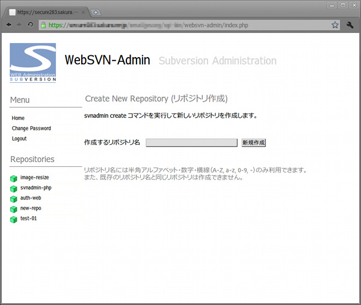
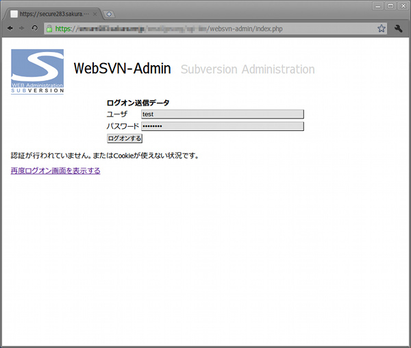

## WebSVN Administrator - Subversionリポジトリ管理（Linux, BSD Web Service）<br />Subversion repository administration script<!-- omit in toc -->

[Home](https://oasis3855.github.io/webpage/) > [Software](https://oasis3855.github.io/webpage/software/index.html) > [Software Download](https://oasis3855.github.io/webpage/software/software-download.html) > [webservice-scripts](../) > ***websvn-admin*** (this page)

<br />
<br />

Last Updated : Jan. 2011

- [ソフトウエアのダウンロード](#ソフトウエアのダウンロード)
- [概要](#概要)
  - [このプログラムで出来ること](#このプログラムで出来ること)
- [動作確認済み](#動作確認済み)
- [インストール方法](#インストール方法)
  - [インストール時の注意事項](#インストール時の注意事項)
- [プログラムの使い方](#プログラムの使い方)
- [このスクリプトは個人利用想定のセキュリティ確保しかしていません](#このスクリプトは個人利用想定のセキュリティ確保しかしていません)
- [バージョン情報](#バージョン情報)
- [ライセンス](#ライセンス)

<br />
<br />

## ソフトウエアのダウンロード

-    [このGitHubリポジトリを参照する（ソースコード）](../websvn-admin/) 
-    [OSDNからダウンロード（ソースコード）](https://ja.osdn.net/projects/websvn-admin/)

## 概要

Webサーバ上で稼動する、ローカル（Webサーバ内の）Subversionのリポジトリ管理。sshで接続してsvnadminコマンドを用いることなく、Web経由でリポジトリの作成や削除などの操作が可能です。

主に、個人でSubversionを使うことを想定しています。

共用サーバなど、***ユーザ権限で（管理者権限を全く使わず）にインストール出来る***ようになっています。また、依存プログラム、ライブラリなどを極力減らして、インストール出来ないということがなるべく起こらないようにしています。 



 新規リポジトリ作成画面 例

### このプログラムで出来ること

- 新しいリポジトリの作成（```svnadmin create```）
- 既存リポジトリのバックアップ（```svnadmin hotcopy```, ```svnadmin dump```）
- 既存リポジトリのベリファイ（```svnadmin verify```）
- 既存リポジトリの削除（```svnadmin hotcopy && rm -rf [repo dir]```）
- 簡易的なユーザ認証による不特定多数の利用防止
- ***リポジトリ・ブラウザは含まれていません！*** （[WebSVN](https://github.com/websvnphp/websvn)などのサードパーティの製品をお使いください） 

## 動作確認済み

- FreeBSD 11.2 , PHP 5.2 , svnadmin 1.6.15  (さくらインターネット 共用サーバ)

## インストール方法

配布しているソースコード・パッケージを、サーバ上の適当なディレクトリ（Webから見れる所）へ解凍してください。

その後、include/config.php に、ユーザの環境に合わせて書き換えてください。例えば、共用サーバでSubversionを /home/user000/local/bin/ にインストールしていて、リポジトリを /home/user000/var/svn/ 以下に作成している場合、次のようになります

```PHP
$strSvnCmdPath = '/home/user000/local/bin/';
$strBaseDir = '/home/user000/var/svn/';
```

include/config.php の設定後、Webよりindex.php へアクセスすると、自動的に data/auth.dat が作成され、初期ユーザ名とパスワードが画面に表示されます。なお、パスワードはMD5ハッシュが保存されるようになっています。 data/auth.dat ファイルは次のようになっています。

```PHP
# user, password
test,1a1dc91c907325c69271ddf0c944bc72
```

最初に、画面左端の Change password を実行して、ユーザ名とパスワードを（セキュリティ上問題ないものに）変更してください。 



### インストール時の注意事項

PHPの session_start(); 関数をWeb出力の途中で利用しているため、syslogに "Cannot send session cache limiter - headers already sent" のエラーが出る場合、セッション処理に失敗しログオン出来ない場合などの場合に備えて、php.ini を同梱しています。WebSVN-Adminのindex.phpと同じディレクトリにphp.iniを置くと、システムの値を上書きしますので、エラーを抑止できます。このphp.iniが必要かどうか、一度php.iniを削除してWebSVN-Adminを利用してみて、問題ないようであれば php.iniは不必要です。

```PHP
; use cookie to handle session data
session.use_cookies = On
session.save_path = "/tmp"

; output buffer (for cookie write)
output_buffering = 4096 
```

## プログラムの使い方

画面上の説明に従って操作してください。 

新規作成するリポジトリ名はUNIXのディレクトリ命名規則に従った入力のみを受け付けます。

## このスクリプトは個人利用想定のセキュリティ確保しかしていません

ここで配布するスクリプトは、個人用として使うことを想定し、不特定多数に公開するレベルのセキュリティ基準を満たしていません。必ず、.htaccess によるディレクトリ自体のアクセス認証を掛けて、本人以外のアクセスが行えないよう設定して下さい。

## バージョン情報

- Version 0.1 (2011/01/16)
- Version 0.2 (2011/01/20)
- Version 0.2b2 (2011/01/22)

## ライセンス

このスクリプトは [GNU General Public License v3ライセンスで公開する](https://gpl.mhatta.org/gpl.ja.html) フリーソフトウエア
